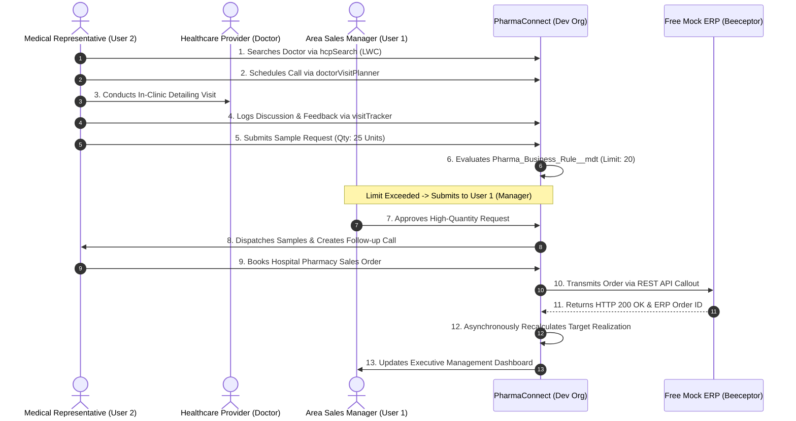

# PharmaConnect — Master Project Documentation

## Pharma Sales & Healthcare Provider Management Platform
> **Salesforce Developer Edition (Free Org) Architecture & Implementation Specification**  
> **Project Code:** `PHARMA-CONNECT` | **Platform:** Free Salesforce Developer Edition Org (`developer.salesforce.com`)  
> **Tooling:** Salesforce CLI (`sf`), VS Code + Extensions, GitHub, Free GitHub Actions CI/CD & Salesforce DevOps Center

---

## Documentation Directory & Modular Guide

This documentation has been partitioned into **13 dedicated modules** under the [`docs/`](docs/) directory. Each module provides comprehensive, technical specifications, diagrams, and step-by-step guidance.

### Quick Documentation Links

| # | Documentation Module | Key Topics Covered | File Link |
| :-: | :--- | :--- | :--- |
| **01** | **Project Overview & System Architecture** | Core capabilities, free dev org objectives, high-level architecture diagram, and business mindmap. | [01_Project_Overview.md](docs/01_Project_Overview.md) |
| **02** | **User Roles & Security Architecture** | 2-user license strategy, OWD sharing settings, role hierarchy, and permission sets. | [02_User_Roles_and_Security.md](docs/02_User_Roles_and_Security.md) |
| **03** | **Data Model & Data Dictionary** | Complete ERD, standard objects, and exhaustive field dictionaries for all 8 custom objects. | [03_Data_Model_and_Dictionary.md](docs/03_Data_Model_and_Dictionary.md) |
| **04** | **Territory Management Architecture** | Zero-cost custom territory hierarchy, public groups, and criteria-based sharing rules. | [04_Territory_Management.md](docs/04_Territory_Management.md) |
| **05** | **Lightning Web Component (LWC) Architecture** | Component catalog, sequence diagrams, and reactive UI-to-Apex communication. | [05_LWC_Architecture.md](docs/05_LWC_Architecture.md) |
| **06** | **Apex Architecture & Trigger Framework** | Enterprise layering (Controller-Service-Selector), SOQL/SOSL queries, and bulkified triggers. | [06_Apex_and_Triggers.md](docs/06_Apex_and_Triggers.md) |
| **07** | **Automation, Business Rules & Approvals** | Record-triggered flows, manager approval processes, Custom Metadata (`__mdt`), and validation rules. | [07_Automation_and_Business_Rules.md](docs/07_Automation_and_Business_Rules.md) |
| **08** | **Operational Reports & Dashboards** | Standard operational reports portfolio and executive leadership dashboard layout. | [08_Analytics_and_Reporting.md](docs/08_Analytics_and_Reporting.md) |
| **09** | **Integration Architecture & Mock REST API** | Free REST mock endpoints (Beeceptor/Mockoon), Named Credentials, and Apex HTTP callouts. | [09_Integration_Architecture.md](docs/09_Integration_Architecture.md) |
| **10** | **DevOps, Salesforce DX & Free CI/CD** | SFDX repository structure, GitFlow branching model, and free GitHub Actions pipeline. | [10_DevOps_and_CICD.md](docs/10_DevOps_and_CICD.md) |
| **11** | **Salesforce DevOps Center (Native Change Management)** | Native change and release management app, GitHub branch sync, Work Items, and pipeline promotions. | [11_Salesforce_DevOps_Center.md](docs/11_Salesforce_DevOps_Center.md) |
| **12** | **Testing Strategy & Data Factory** | Testing multiple personas with `System.runAs()`, bulk testing, and `TestDataFactory`. | [12_Testing_Strategy.md](docs/12_Testing_Strategy.md) |
| **13** | **Project Management & Governance** | 18-member squad distribution, free agile tracking, Definition of Done, and roadmap. | [13_Project_Management_and_Governance.md](docs/13_Project_Management_and_Governance.md) |

---

## Free Developer Edition Org Feasibility Summary

| Component | Standard Paid Org | Free Developer Edition Implementation | Module Reference |
| :--- | :--- | :--- | :--- |
| **Salesforce Licenses** | Unlimited / Paid per seat | **2 Full Salesforce Licenses** available: • **User 1:** System Administrator & Area Sales Manager (`System Admin`) • **User 2:** Medical Representative (`Custom: Medical Rep`) • *Additional personas are simulated using Apex `System.runAs()` test classes.* | [Module 02](docs/02_User_Roles_and_Security.md) |
| **Sandboxes** | Developer, Partial, Full Sandboxes | **Multi-Dev Org Strategy:** Each developer signs up for their own free Dev Org (`developer.salesforce.com`), commits metadata to a shared GitHub repo, and deploys to a shared **"Master Demo Dev Org"**. | [Module 10](docs/10_DevOps_and_CICD.md) |
| **Territory Management** | Enterprise Territory Management (ETM 2.0) | **Custom Territory Engine:** Configured using custom fields (`Territory__c`), custom Role Hierarchy, and Criteria-Based Sharing Rules. | [Module 04](docs/04_Territory_Management.md) |
| **External ERP Integration** | Paid ERP Sandbox / Middleware | **Free Mock REST API:** Built with **Beeceptor**, **Mockoon**, or **Postman Mock Server** (free tiers) via Salesforce Named Credentials. | [Module 09](docs/09_Integration_Architecture.md) |
| **Change & Release Management** | Paid Third-Party Tools (Copado / Gearset) | **Native Salesforce DevOps Center:** Free managed package connected to GitHub with graphical Work Item tracking and pipeline stages. | [Module 11](docs/11_Salesforce_DevOps_Center.md) |
| **CI/CD Pipeline** | Enterprise Jenkins Server | **Free GitHub Actions** running `sf project deploy validate` and automated Apex testing on every pull request. | [Module 10](docs/10_DevOps_and_CICD.md) |
| **Project Tracking** | Paid Jira Enterprise | **Free Jira Cloud** (free up to 10 users), **DevOps Center Work Items**, or **GitHub Projects** (100% free, integrated with repo). | [Module 13](docs/13_Project_Management_and_Governance.md) |

---

## End-to-End Business Scenario Execution

---

## Project Checklist

- [x] Documentation partitioned into 13 modular files under [`docs/`](docs/)
- [x] Two-user persona model defined for free Salesforce Dev Orgs
- [x] Full data dictionary with standard & custom objects
- [x] LWC catalog with sequence diagrams and wire/imperative patterns
- [x] Enterprise Apex architecture with trigger framework
- [x] Zero-cost REST mock API callout with Named Credentials
- [x] Native Salesforce DevOps Center release & change management guide
- [x] Automated free GitHub Actions CI/CD pipeline
- [x] Agile tracking, Definition of Done, and team squad distribution
