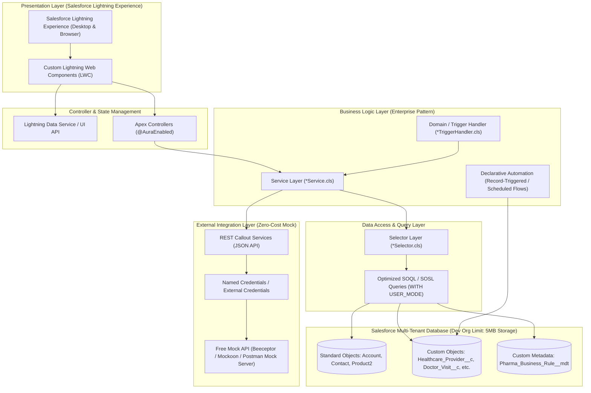
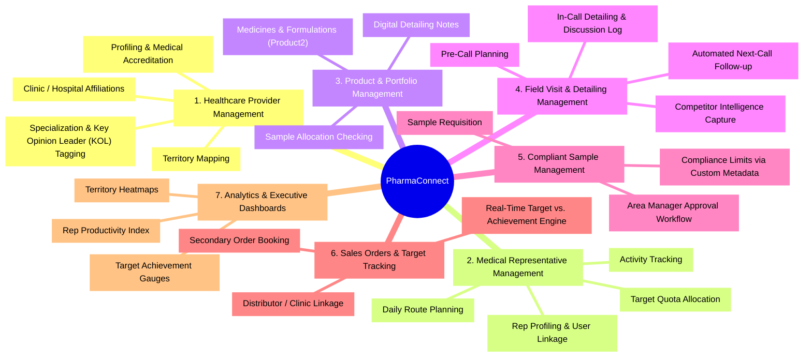

# 01. Project Overview & System Architecture

[← Back to Master Documentation Index](../PharmaConnect_Project_Documentation.md)

---

## 1. Executive Summary

**PharmaConnect** is a comprehensive, production-patterned Salesforce CRM application designed specifically to be built, configured, and demonstrated entirely within a **Free Salesforce Developer Edition Org**.

It unifies Healthcare Provider (HCP) relationship management, Medical Representative (MR) field operations, sample distribution tracking, sales order processing, and territory-driven target analytics into a compliant, automated, and secure ecosystem.

---

## 2. Core Business Capabilities

Pharma organizations require field operational tracking and compliance with pharmaceutical regulations (e.g., sample handling limits, accurate detailing records, and auditable visits). **PharmaConnect** centralizes:

* **Healthcare Providers (HCPs):** Doctors, specialists, clinics, hospital departments, and pharmacies.
* **Field Force / Medical Reps:** Daily scheduling, route planning, call logs, and performance tracking.
* **Product Catalog & Detailing:** Approved medicine portfolio, therapeutic classes, brochures, and discussion logging.
* **Compliant Sample Management:** Inventory requests, validation against quota thresholds, and dual-authorization approvals.
* **Order & Target Realization:** Secondary sales order booking, distributor mapping, and quota achievement calculations.
* **Territory & Reporting Insights:** Multi-tier territory roll-ups, executive sales trends, and rep productivity KPIs.

---

## 3. Developer Edition Learning Objectives

* Build a full-scale enterprise application completely within the **Free Salesforce Developer Edition** limits.
* Master **Separation of Concerns (SoC)** in Apex (Controller, Service, Selector, Domain/Handler).
* Implement mobile-responsive **Lightning Web Components (LWC)** communicating reactively with Apex.
* Implement declarative automations (**Record-Triggered Flows**) and programmatic bulkified triggers without recursion.
* Setup automated **CI/CD with GitHub Actions** and **Salesforce CLI** at zero financial cost.

---

## 4. Overall Architecture

---

## 5. Business Domain Mindmap

---

[Next: 02. User Roles & Security Setup →](02_User_Roles_and_Security.md)
