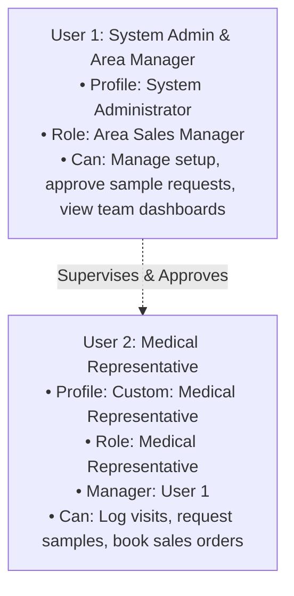
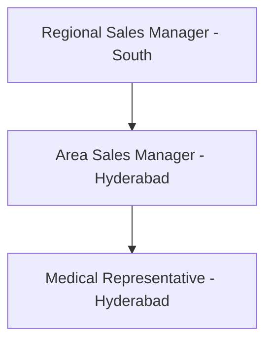

# 02. User Roles & Security Architecture

[← Back to Master Documentation Index](../PharmaConnect_Project_Documentation.md) | [← Prev: 01. Project Overview](01_Project_Overview.md) | [Next: 03. Data Model & Dictionary →](03_Data_Model_and_Dictionary.md)

---

## 1. Free Dev Org 2-License Persona Strategy

A standard Free Salesforce Developer Edition Org provides exactly **2 active full Salesforce user licenses**. The architecture maps all multi-user enterprise flows into these two active users:

### Persona Assignments

| User Profile / Persona | Assigned In Dev Org As | Primary Responsibilities |
| :--- | :--- | :--- |
| **System Administrator & Area Manager** | **Active User 1** (Full Salesforce License) | • Administers the org, builds schemas, and deploys metadata. • Acts as Manager in approval processes (approving high-quantity samples). • Views roll-up dashboards and team performance. |
| **Medical Representative** | **Active User 2** (Full Salesforce License) | • Everyday field operations user. • Records visits, enters product discussions, and submits orders. • Owns assigned Healthcare Providers and Visits in their territory. |
| **Regional Sales Manager (RSM)** | Role in Hierarchy / Simulated via Apex Tests | • Top-level executive in Role Hierarchy (parent of Area Manager). • Thoroughly tested in Apex using `System.runAs(rsmUser)`. |
| **Sales Operations / Billing** | Simulated via Permission Sets | • Grants custom permissions (e.g., `Pharma Product Management`) to User 1 or User 2 as needed. |

> [!TIP]
> **Simulating Medical Rep in the UI:**
> In **Setup → Users**, enable **"Administrators Can Log In as Any User"**. Then, User 1 (Admin) can simply click **Login** next to User 2 to experience the full Medical Rep perspective without logging out.

---

## 2. Organization-Wide Defaults (OWD)

| Object | OWD Sharing Setting | Rationale for Free Dev Org |
| :--- | :--- | :--- |
| **Account** | Public Read Only | Standard accounts (Clinics/Hospitals) visible to all reps. |
| **Contact** | Controlled by Parent | Inherits Account visibility. |
| **Product2** | Public Read Only | Medicine catalog accessible to all users. |
| **Healthcare_Provider__c** | Private | Restricts doctor access to assigned territory rep; opened via criteria sharing. |
| **Medical_Representative__c**| Public Read Only | Rep directory accessible for lookups. |
| **Doctor_Visit__c** | Private | Field visits accessible only to Rep and their Manager. |
| **Product_Discussion__c** | Controlled by Parent | Master-Detail relationship with `Doctor_Visit__c`. |
| **Sample_Request__c** | Private | Reps view their own requests; Managers view via Role Hierarchy. |
| **Sales_Order__c** | Private | Orders visible only to booking rep and management. |
| **Sales_Order_Line__c** | Controlled by Parent | Master-Detail relationship with `Sales_Order__c`. |
| **Sales_Target__c** | Private | Quotas visible to assigned rep and Manager. |
| **Follow_Up__c** | Private | Assigned to specific representative. |

---

## 3. Role Hierarchy Setup (Setup → Roles)

* Assign **User 1 (Admin)** to the **Area Sales Manager** role.
* Assign **User 2 (Rep)** to the **Medical Representative** role.
* Ensure **Grant Access Using Hierarchies** is checked on all custom objects so User 1 automatically inherits full visibility over User 2's records.

---

## 4. Permission Sets

Create 4 custom Permission Sets (**Setup → Permission Sets**) to assign modular capabilities:

| Permission Set Name | Description | Key Permissions Included |
| :--- | :--- | :--- |
| `Pharma_Representative_Access` | Base field force operational access | • Read on `Account`, `Contact`, and `Product2` (all basic, inventory & clinical fields). • Read/Create/Edit on `Healthcare_Provider__c`, `Doctor_Visit__c`, `Sample_Request__c`, and `Sales_Order__c`. |
| `Pharma_Product_Catalog_Admin`| Product master data maintenance | • Create/Read/Edit/Delete on `Product2` (Basic, Inventory, and Clinical information fields) and standard Price Books. • Read on Accounts and custom objects. |
| `Pharma_Sample_Approver` | Sample compliance manager | • Allows reviewing, approving, rejecting, and status modification on `Sample_Request__c`. |
| `Pharma_Executive_Analytics` | Analytical reporting access | • Access to executive reports, dashboards, territory metrics, and `Sales_Target__c` tracking. |

---

[Next: 03. Data Model & Dictionary →](03_Data_Model_and_Dictionary.md)
