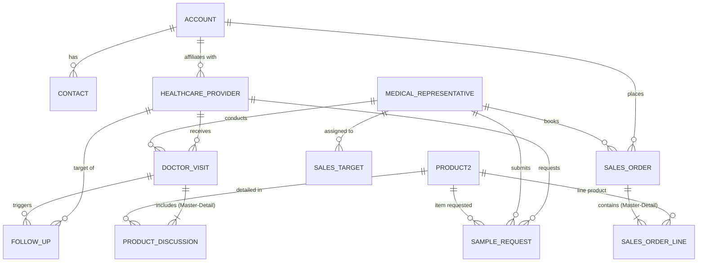

# 03. Data Model & Data Dictionary

[← Back to Master Documentation Index](../PharmaConnect_Project_Documentation.md) | [← Prev: 02. User Roles & Security](02_User_Roles_and_Security.md) | [Next: 04. Territory Management →](04_Territory_Management.md)

---

## 1. Entity-Relationship Diagram (ERD)



---

## 2. Standard Objects Used

| Object | Standard API Name | Business Purpose |
| :--- | :--- | :--- |
| **Account** | `Account` | Represents clinics, hospitals, pharmacies, and distributors. |
| **Contact** | `Contact` | Represents medical staff, pharmacists, and clinic assistants. |
| **Product** | `Product2` | Represents pharmaceutical medicines, strengths, formulations, clinical data, and collateral. |
| **User** | `User` | Active Salesforce login accounts (Field Reps and Managers). |

---

### 2.1 `Account` (Hospitals, Clinics, Retail Pharmacies & Distributors)
Represents institutional healthcare accounts, institutional buyers, hospital networks, retail pharmacies, and wholesale stockists.

| Field Label | API Name | Data Type | Attributes | Description |
| :--- | :--- | :--- | :--- | :--- |
| **Account Name** | `Name` | Text(255) | Standard, Required | Official legal entity or trade name of the healthcare institution or pharmacy. |
| **Account Type** | `Type` | Picklist | Standard | `Hospital`, `Private Clinic`, `Retail Pharmacy`, `Wholesale Stockist / Distributor`, `Research Institute`. |
| **Account Number** | `AccountNumber` | Text(40) | Standard | Internal ERP or customer account code. |
| **Drug License Number** | `Drug_License_Number__c`| Text(50) | Custom, Unique | Mandatory statutory pharmaceutical drug retail/wholesale license number. |
| **Territory** | `Territory__c` | Text(80) | Custom, Indexed | Geographical territory assignment (e.g., `Hyderabad Central`, `Mumbai South`). |
| **Institution Tier** | `Tier__c` | Picklist | Custom, Default: `Tier B` | Commercial priority rating: `Tier A` (High-Volume Institution), `Tier B`, `Tier C`. |
| **Phone** | `Phone` | Phone | Standard | Primary institutional telephone switchboard number. |
| **Website** | `Website` | URL(255) | Standard | Official institutional website or portal. |
| **Billing Address** | `BillingAddress` | Address | Standard (Compound) | Official postal invoicing and billing location. |
| **Shipping Address** | `ShippingAddress` | Address | Standard (Compound) | Physical delivery and loading dock address for pharmaceutical dispatches. |
| **Bed Capacity** | `Bed_Capacity__c` | Number(5, 0) | Custom | Inpatient bed count (for hospital accounts to evaluate procurement volume). |
| **Credit Limit** | `Credit_Limit__c` | Currency(12, 2)| Custom | Maximum commercial credit allowed for distributor/pharmacy orders. |
| **Active Status** | `Active__c` | Picklist | Custom, Default: `Yes` | Operational status: `Yes`, `No`. |

---

### 2.2 `Contact` (Key Hospital Staff, Chief Pharmacists & Administrators)
Represents administrative contacts, chief hospital pharmacists, clinical purchase heads, and clinic managers (doctors are tracked in `Healthcare_Provider__c`).

| Field Label | API Name | Data Type | Attributes | Description |
| :--- | :--- | :--- | :--- | :--- |
| **Full Name** | `Name` | Name (Compound) | Standard, Required | `FirstName` and `LastName` of the contact person. |
| **Account Name** | `AccountId` | Lookup(`Account`) | Standard, Required | Parent hospital, clinic, or pharmacy where the contact is stationed. |
| **Designation / Title** | `Title` | Text(128) | Standard | Operational title: `Chief Pharmacist`, `Purchase Manager`, `Clinical Director`, `Hospital Administrator`. |
| **Department** | `Department` | Text(80) | Standard | Departmental unit: `Procurement & Supplies`, `Inpatient Pharmacy`, `Clinical Administration`. |
| **Email** | `Email` | Email | Standard | Primary email address for order notifications, invoices, and circulars. |
| **Phone** | `Phone` | Phone | Standard | Direct desk phone or hospital internal extension. |
| **Mobile Phone** | `MobilePhone` | Phone | Standard | Direct mobile number for delivery and order follow-ups. |
| **Primary Contact** | `Primary_Contact__c` | Checkbox | Custom, Default: `false` | Indicates whether this contact is the chief procurement or operations decision-maker. |
| **Preferred Contact Mode**| `Preferred_Contact_Mode__c`| Picklist | Custom | `Phone`, `Email`, `WhatsApp`, `In-Person`. |

---

### 2.3 `Product2` (Pharmaceutical Product Master Dictionary)
Represents commercial medicines, formulations, clinical detailing specs, and sample inventory tracking.

#### A. Basic & Inventory Information
| Field Label | API Name | Data Type | Attributes | Description |
| :--- | :--- | :--- | :--- | :--- |
| **Product Name** | `Name` | Text(255) | Standard, Required | Commercial brand name of the drug (e.g., `CardioCare 10mg`, `NeuroPlus 50mg`). |
| **Product Code** | `ProductCode` | Text(255) | Standard, Unique/Indexed | SKU identifier code (e.g., `CAR-10`, `NEU-50`, `IMM-100`). |
| **Status** | `IsActive` | Checkbox | Standard, Default: `true` | Indicates if medicine is active for field detailing, sample requests, and sales orders. |
| **Therapeutic Class** | `Therapeutic_Class__c` | Picklist | Required | Medical category: `Cardiology`, `Neurology`, `Immunology`, `Dermatology`, `Gastroenterology`, `Orthopedics`, `Pediatrics`, `Oncology`, `Pulmonology`, `General Medicine`. |
| **Formulation** | `Formulation__c` | Picklist | Required | Drug dosage form: `Tablet`, `Capsule`, `Syrup`, `Tube`, `Inhaler`, `Injection`, `Drops`. |
| **Strength** | `Strength__c` | Text(50) | Required | Dosage concentration (e.g., `10 mg`, `50 mg`, `100 mg / 5ml`, `20 g`, `100 mcg`). |
| **Pack Size** | `Pack_Size__c` | Text(50) | Required | Packaging unit specifications (e.g., `30 Tablets`, `10 Capsules`, `100 ml`, `1 unit`, `200 doses`). |
| **Available Stock** | `Available_Stock__c` | Number(10, 0) | Default: `0` | Available warehouse inventory count for dispatch, sales orders, and rep sample allocations. |

#### B. Clinical & Detailing Information
| Field Label | API Name | Data Type | Attributes | Description |
| :--- | :--- | :--- | :--- | :--- |
| **Indications** | `Indications__c` | Long Text Area(1000) | — | Medical conditions and disease indications approved for treatment (e.g., `Hypertension, Angina`). |
| **Dosage Information** | `Dosage_Information__c` | Long Text Area(1000) | — | Recommended dosage administration regimen (e.g., `10 mg once daily or as directed by physician`). |
| **Contraindications** | `Contraindications__c` | Long Text Area(1000) | — | Patient safety warnings, contraindications, and precautions (e.g., `Severe hypotension, pregnancy (Category C)`). |
| **Key Benefits** | `Key_Benefits__c` | Rich Text Area(2000) | — | Bulleted clinical benefits & detailing talking points for HCP engagements (e.g., `Effective BP control, Well tolerated`). |

---

### 2.4 `User` (Salesforce Login Accounts & Field Identities)
Represents the active licensed Salesforce system users (Medical Representatives, Area Sales Managers, and Administrators).

| Field Label | API Name | Data Type | Attributes | Description |
| :--- | :--- | :--- | :--- | :--- |
| **Full Name** | `Name` | Name (Compound) | Standard, Required | `FirstName` and `LastName` of the employee. |
| **Username** | `Username` | Email | Standard, Unique | Unique corporate login identifier (e.g., `rep.user@pharmaconnect.dev`). |
| **Email** | `Email` | Email | Standard, Required | Primary business communication email. |
| **User Profile** | `ProfileId` | Lookup(`Profile`) | Standard, Required | Assigned profile: `System Administrator`, `Custom: Medical Representative`. |
| **Role Hierarchy** | `UserRoleId` | Lookup(`UserRole`) | Standard | Placement in role hierarchy: `Area Sales Manager`, `Medical Representative`. |
| **Manager** | `ManagerId` | Hierarchy(`User`) | Standard | Direct supervisor user used in automated approval routing (e.g., high-volume sample requests). |
| **Territory Code** | `Territory_Code__c` | Text(50) | Custom, Indexed | Primary territory identifier for record ownership and sharing rules (e.g., `HYD-CENTRAL-01`). |
| **Active Status** | `IsActive` | Checkbox | Standard, Default: `true` | Indicates whether the user can authenticate and execute actions in the org. |
| **Employee Number** | `EmployeeNumber` | Text(20) | Standard | Official HR employee identification number. |
| **User License** | `UserLicense` | Standard Type | Standard | Standard `Salesforce` full CRM license. |


---

## 3. Custom Objects & Field Dictionary

### 3.1 `Healthcare_Provider__c`
Represents doctors and medical practitioners.

| Field Label | API Name | Data Type | Attributes | Description |
| :--- | :--- | :--- | :--- | :--- |
| **HCP Record ID** | `Name` | Auto-Number | Format: `HCP-{00000}` | Standard Name field |
| **Provider Name** | `Provider_Name__c` | Text(100) | Required | Doctor's full name |
| **Specialization** | `Specialization__c` | Picklist | Restricted | Cardiology, Oncology, Neurology, Pediatrics, Orthopedics, General Medicine |
| **License Number** | `License_Number__c` | Text(50) | Unique, External ID | Medical Council Registration No. |
| **Provider Type** | `Provider_Type__c` | Picklist | Required | Specialist, General Practitioner, Consultant, Department Head |
| **Phone** | `Phone__c` | Phone | — | Direct phone contact |
| **Email** | `Email__c` | Email | — | Primary email address |
| **Account** | `Account__c` | Lookup(`Account`) | Optional | Primary hospital, clinic, or medical institute |
| **Territory** | `Territory__c` | Text(80) | Indexed | Assigned sales territory (e.g., `Hyderabad Central`) |
| **Status** | `Status__c` | Picklist | Default: `Pending Verification` | Active, Inactive, Pending Verification |
| **Preferred Contact Method** | `Preferred_Contact_Method__c`| Picklist | — | In-Person, Video Call, Phone, Email |

---

### 3.2 `Medical_Representative__c`
Represents the field sales force members and profiles.

| Field Label | API Name | Data Type | Attributes | Description |
| :--- | :--- | :--- | :--- | :--- |
| **Rep Name** | `Name` | Text(100) | Required | Standard Name field |
| **Employee ID** | `Employee_ID__c` | Text(30) | Unique, Required | Internal corporate staff identifier |
| **Salesforce User**| `User__c` | Lookup(`User`) | Unique | Linked Salesforce active user account |
| **Territory** | `Territory__c` | Text(80) | Indexed | Primary operating territory |
| **Manager** | `Manager__c` | Lookup(`Medical_Representative__c`)| Optional | Hierarchy reporting manager (ASM) |
| **Region** | `Region__c` | Picklist | Required | North, South, East, West, Central |
| **Status** | `Status__c` | Picklist | Default: `Active` | Active, On Leave, Inactive |
| **Joining Date** | `Joining_Date__c` | Date | — | Employment commencement date |

---

### 3.3 `Doctor_Visit__c`
Records field calls made by Medical Representatives to Healthcare Providers.

| Field Label | API Name | Data Type | Attributes | Description |
| :--- | :--- | :--- | :--- | :--- |
| **Visit Number** | `Name` | Auto-Number | Format: `VST-{000000}` | Standard Visit identifier |
| **Healthcare Provider** | `Healthcare_Provider__c` | Lookup(`Healthcare_Provider__c`)| Required | Contacted doctor |
| **Medical Representative**| `Medical_Representative__c`| Lookup(`Medical_Representative__c`)| Required | Field rep executing the call |
| **Visit Date** | `Visit_Date__c` | DateTime | Required | Date and timestamp of the call |
| **Visit Type** | `Visit_Type__c` | Picklist | Required | Routine Detailing, Product Launch, Follow-up, Sample Drop |
| **Purpose** | `Purpose__c` | Text(255) | — | Objective of the engagement |
| **Status** | `Status__c` | Picklist | Default: `Planned` | Planned, Completed, Rescheduled, Cancelled |
| **Outcome** | `Outcome__c` | Picklist | — | Highly Positive, Neutral, Hesitant, Objections Raised |
| **Next Follow-up Date** | `Next_Follow_up_Date__c` | Date | — | Scheduled date for next touchpoint |
| **Notes** | `Notes__c` | Long Text Area(32768) | — | Detailing summary and doctor remarks |

---

### 3.4 `Product_Discussion__c`
Captures specific products discussed during a visit (Master-Detail).

| Field Label | API Name | Data Type | Attributes | Description |
| :--- | :--- | :--- | :--- | :--- |
| **Discussion ID** | `Name` | Auto-Number | Format: `DISC-{000000}`| Standard Name field |
| **Doctor Visit** | `Doctor_Visit__c` | Master-Detail(`Doctor_Visit__c`)| Required | Parent field visit call |
| **Product** | `Product__c` | Lookup(`Product2`)| Required | Medicine discussed |
| **Interest Level** | `Interest_Level__c` | Picklist | Required | High, Medium, Low, Not Interested |
| **Feedback** | `Feedback__c` | Long Text Area(4000) | — | Doctor impressions & dosage queries |
| **Competitor Mentioned**| `Competitor_Mentioned__c` | Text(100) | — | Competing brand referenced |
| **Follow-up Required** | `Follow_up_Required__c` | Checkbox | Default: `false` | Indicates follow-up action needed |

---

### 3.5 `Sample_Request__c`
Tracks sample allocation and distribution compliance.

| Field Label | API Name | Data Type | Attributes | Description |
| :--- | :--- | :--- | :--- | :--- |
| **Request Number** | `Name` | Auto-Number | Format: `SMP-{000000}`| Unique request tracking number |
| **Healthcare Provider** | `Healthcare_Provider__c` | Lookup(`Healthcare_Provider__c`)| Required | Recipient physician |
| **Medical Representative**| `Medical_Representative__c`| Lookup(`Medical_Representative__c`)| Required | Requesting sales representative |
| **Product** | `Product__c` | Lookup(`Product2`)| Required | Sample medicine requested |
| **Quantity** | `Quantity__c` | Number(5, 0) | Required | Unit count requested |
| **Request Date** | `Request_Date__c` | Date | Default: `TODAY()` | Date requisition logged |
| **Status** | `Status__c` | Picklist | Default: `Draft` | Draft, Submitted, Pending Approval, Approved, Dispatched, Delivered, Rejected |
| **Approved By** | `Approved_By__c` | Lookup(`User`)| Optional | Authorizing Area Manager (User 1) |
| **Approval Date** | `Approval_Date__c` | DateTime | Optional | Timestamp of managerial sign-off |

---

### 3.6 `Sales_Order__c` & `Sales_Order_Line__c`

#### `Sales_Order__c`
| Field Label | API Name | Data Type | Attributes | Description |
| :--- | :--- | :--- | :--- | :--- |
| **Order Number** | `Name` | Auto-Number | Format: `ORD-{000000}`| Standard Order code |
| **Account** | `Account__c` | Lookup(`Account`)| Required | Ordering hospital, clinic, or pharmacy |
| **Distributor** | `Distributor__c` | Lookup(`Account`)| Optional | Fulfillment stockist |
| **Order Date** | `Order_Date__c` | Date | Default: `TODAY()` | Order booking date |
| **Status** | `Status__c` | Picklist | Default: `Draft` | Draft, Submitted, Approved, Invoiced, Cancelled |
| **Total Amount** | `Total_Amount__c` | Roll-up Summary(`SUM`)| Calculated | Total value of order line items |
| **Sales Representative**| `Sales_Representative__c`| Lookup(`Medical_Representative__c`)| Required | Rep booking the order |

#### `Sales_Order_Line__c` (Master-Detail to `Sales_Order__c`)
| Field Label | API Name | Data Type | Attributes | Description |
| :--- | :--- | :--- | :--- | :--- |
| **Line Item ID** | `Name` | Auto-Number | Format: `ORD-LINE-{000000}`| Standard Name field |
| **Sales Order** | `Sales_Order__c` | Master-Detail(`Sales_Order__c`)| Required | Parent Sales Order |
| **Product** | `Product__c` | Lookup(`Product2`)| Required | Medicine ordered |
| **Quantity** | `Quantity__c` | Number(6, 0) | Required | Number of units ordered |
| **Unit Price** | `Unit_Price__c` | Currency(12, 2)| Required | Unit selling price |
| **Discount (%)** | `Discount_Percentage__c` | Percent(5, 2)| Default: `0.00` | Applied discount |
| **Total Price** | `Total_Price__c` | Formula(Currency)| `Quantity__c * Unit_Price__c * (1 - Discount_Percentage__c)` | Calculated line price |

---

### 3.7 `Sales_Target__c`
Captures monthly quotas per representative.

| Field Label | API Name | Data Type | Attributes | Description |
| :--- | :--- | :--- | :--- | :--- |
| **Target Code** | `Name` | Auto-Number | Format: `TGT-{000000}`| Standard identifier |
| **Medical Representative**| `Medical_Representative__c`| Lookup(`Medical_Representative__c`)| Required | Target owner |
| **Territory** | `Territory__c` | Text(80) | Required | Applicable sales territory |
| **Target Month** | `Target_Month__c` | Date | Required | 1st day of target month |
| **Target Amount** | `Target_Amount__c` | Currency(14, 2)| Required | Sales quota for the month |
| **Achieved Amount**| `Achieved_Amount__c` | Currency(14, 2)| Default: `0.00` | Realized sales value from invoiced orders |
| **Achievement (%)**| `Achievement_Percentage__c` | Formula(Percent)| `IF(Target_Amount__c > 0, Achieved_Amount__c / Target_Amount__c, 0)` | Real-time realization percentage |

---

### 3.8 `Follow_Up__c`
Tracks post-call action items.

| Field Label | API Name | Data Type | Attributes | Description |
| :--- | :--- | :--- | :--- | :--- |
| **Follow-Up ID** | `Name` | Auto-Number | Format: `FLP-{000000}`| Standard Name field |
| **Related Visit** | `Related_Visit__c` | Lookup(`Doctor_Visit__c`)| Optional | Parent field visit |
| **Healthcare Provider** | `Healthcare_Provider__c` | Lookup(`Healthcare_Provider__c`)| Required | Associated doctor |
| **Assigned To** | `Assigned_To__c` | Lookup(`User`)| Required | Owner responsible for execution |
| **Due Date** | `Due_Date__c` | Date | Required | Target completion date |
| **Priority** | `Priority__c` | Picklist | Default: `Normal` | High, Normal, Low |
| **Status** | `Status__c` | Picklist | Default: `Open` | Open, In Progress, Completed, Overdue |
| **Notes** | `Notes__c` | Text Area(255) | — | Action item instructions |

---

## 4. Relationship Data Flow

```text
Account (Hospital / Clinic / Pharmacy)
   ├── Contact (Doctor / Pharmacist)
   ├── Healthcare_Provider__c (Lookup Account)
   └── Sales_Order__c (Lookup Account)
          └── Sales_Order_Line__c [Master-Detail Sales_Order__c]
                 └── Product2 (Lookup)

Healthcare_Provider__c
   ├── Doctor_Visit__c (Lookup)
   │      ├── Product_Discussion__c [Master-Detail Doctor_Visit__c]
   │      │      └── Product2 (Lookup)
   │      └── Follow_Up__c (Lookup Related_Visit__c)
   └── Sample_Request__c (Lookup)
          └── Product2 (Lookup)

Medical_Representative__c
   ├── Doctor_Visit__c (Lookup)
   ├── Sample_Request__c (Lookup)
   ├── Sales_Order__c (Lookup Sales_Representative__c)
   └── Sales_Target__c (Lookup)
```

---

[Next: 04. Territory Management →](04_Territory_Management.md)
