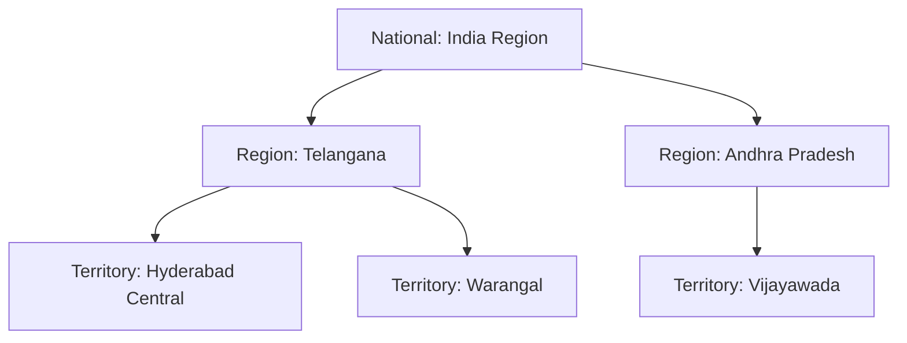

# 04. Territory Management Architecture

[← Back to Master Documentation Index](../PharmaConnect_Project_Documentation.md) | [← Prev: 03. Data Model & Dictionary](03_Data_Model_and_Dictionary.md) | [Next: 05. LWC Architecture →](05_LWC_Architecture.md)

---

## 1. Overview & Free Dev Org Feasibility

In paid Enterprise editions, organizations frequently use Enterprise Territory Management (ETM 2.0). In a **Free Salesforce Developer Edition Org**, you can implement a 100% reliable, zero-cost custom territory model using native platform declarative tools:
1. Custom field `Territory__c` on key objects.
2. Standard **Role Hierarchy**.
3. **Criteria-Based Sharing Rules** mapped to **Public Groups**.

---

## 2. Territory Hierarchy Model

---

## 3. Step-by-Step Setup in Free Dev Org

### Step 1: Create Territory Fields
Create a custom text or picklist field `Territory__c` on:
* `Healthcare_Provider__c`
* `Medical_Representative__c`
* `Doctor_Visit__c`
* `Sales_Target__c`

### Step 2: Configure Public Groups
Go to **Setup → Public Groups** and create groups for each territory node:
* `Group_Territory_Hyderabad_Central`
* `Group_Territory_Warangal`
* `Group_Territory_Vijayawada`

Assign Medical Representatives (e.g., User 2) to their respective territory public group.

### Step 3: Configure Criteria-Based Sharing Rules
Go to **Setup → Sharing Settings → Healthcare_Provider__c Sharing Rules**:
* **Rule Name:** `Share_Hyderabad_Central_HCPs`
* **Rule Type:** Based on criteria
* **Field Criteria:** `Territory__c` EQUALS `Hyderabad Central`
* **Share with:** Public Group `Group_Territory_Hyderabad_Central`
* **Access Level:** Read/Write

### Step 4: Manager Visibility Verification
Because the **Area Sales Manager** role sits directly above the **Medical Representative** role in the standard Role Hierarchy, managers (User 1) automatically inherit full read/write/edit access over all records created in child territories.

---

[Next: 05. LWC Architecture →](05_LWC_Architecture.md)
