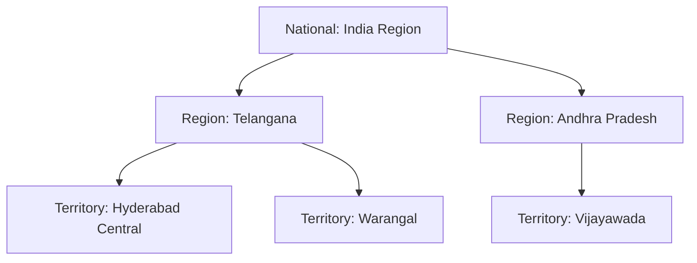

# 04. Territory Management Architecture

[← Back to Master Documentation Index](../PharmaConnect_Project_Documentation.md) | [← Prev: 03. Data Model & Dictionary](03_Data_Model_and_Dictionary.md) | [Next: 05. LWC Architecture →](05_LWC_Architecture.md)

---

## 1. Overview & Free Dev Org Feasibility

In paid Enterprise editions, organizations frequently use Enterprise Territory Management (ETM 2.0). In a **Free Salesforce Developer Edition Org**, you can implement a 100% reliable, zero-cost custom territory model using native platform declarative tools:
1. Custom field `Territory__c` on key objects.
2. Standard **Role Hierarchy**.
3. **Criteria-Based Sharing Rules** mapped to **Public Groups**.

---

## 2. Territory Hierarchy Model



---

---

## 3. Implementation: Metadata vs. Admin UI

PharmaConnect provides full support for **both** automated metadata deployment and point-and-click Salesforce Setup administration:

| Component | Metadata API Artifact | Admin Setup Alternative (UI) | Current Status |
| :--- | :--- | :--- | :--- |
| **Public Groups** | `force-app/main/default/groups/Group_Territory_*.group-meta.xml` | **Setup → Users → Public Groups → New** | ✅ Deployed & Active |
| **Group Memberships** | Data record (`GroupMember` via Apex) | **Setup → Users → Public Groups → Edit → Add User** | ✅ Assigned (User 2) |
| **Sharing Rules** | `force-app/main/default/sharingRules/Healthcare_Provider__c.sharingRules-meta.xml` | **Setup → Security → Sharing Settings → Healthcare Provider Sharing Rules** | ✅ Deployed & Active |
| **Role Hierarchy** | `force-app/main/default/roles/*.role-meta.xml` | **Setup → Users → Roles** | ✅ Deployed & Active |
| **Med Rep Profile** | `Medical_Representative__c` record | **App Launcher → Medical Representatives → New/Edit** | ✅ Configured (User 2) |

---

## 4. Territory Configuration Details

### Step 1: Territory Public Groups
The following territory public groups are configured in the org:
* `Group_Territory_Hyderabad_Central` (`Territory: Hyderabad Central`)
* `Group_Territory_Warangal` (`Territory: Warangal`)
* `Group_Territory_Vijayawada` (`Territory: Vijayawada`)

**Membership:** User 2 (`harishlankepalli555@gmail.com.devbox1`) is explicitly assigned to `Group_Territory_Hyderabad_Central`.

### Step 2: Criteria-Based Sharing Rules
Deployed on `Healthcare_Provider__c` (Organization-Wide Default: **Private**):

| Rule API Name | Label | Criteria | Shared To | Access Level |
| :--- | :--- | :--- | :--- | :--- |
| `Share_Hyderabad_Central_HCPs` | Share Hyderabad Central HCPs | `Territory__c = 'Hyderabad Central'` | `Group_Territory_Hyderabad_Central` | **Read/Write** (`Edit`) |
| `Share_Warangal_HCPs` | Share Warangal HCPs | `Territory__c = 'Warangal'` | `Group_Territory_Warangal` | **Read/Write** (`Edit`) |
| `Share_Vijayawada_HCPs` | Share Vijayawada HCPs | `Territory__c = 'Vijayawada'` | `Group_Territory_Vijayawada` | **Read/Write** (`Edit`) |

### Step 3: Role Hierarchy Visibility
* User 1 is assigned the **Area Sales Manager - Hyderabad** role.
* User 2 is assigned the **Medical Representative - Hyderabad** role.
* Because `Medical_Representative_Hyderabad` reports directly to `Area_Sales_Manager_Hyderabad`, User 1 automatically inherits full Read, Edit, and Delete access over all records owned by User 2 through standard Salesforce Role Hierarchy access grant.

---

## 5. Verification & Testing

To run the automated territory configuration and access validation, execute:

```powershell
sf apex run --target-org sf-ep-dev --file scripts/apex/validate_territory_sharing.apex
```

### Validation Checks Performed:
1. **MR Territory Access:** Verifies that records matching `Territory__c = 'Hyderabad Central'` are granted Read & Edit access to User 2 via the sharing rule.
2. **Least Privilege Isolation:** Verifies that records matching `Territory__c = 'Warangal'` are inaccessible (`HasReadAccess = false`) to User 2.
3. **Manager Role Hierarchy Visibility:** Verifies that records owned by User 2 are fully visible and editable by User 1 (Area Sales Manager).

---

[Next: 05. LWC Architecture →](05_LWC_Architecture.md)
