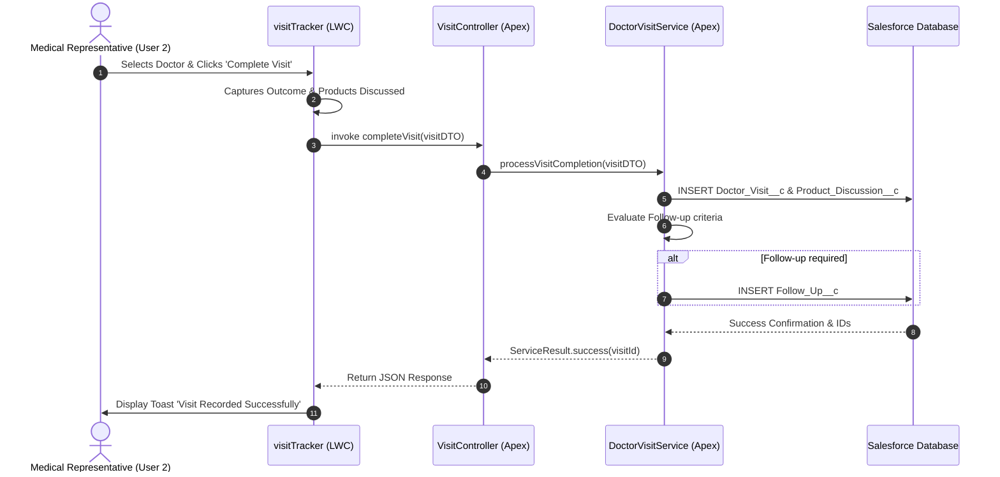

# 05. Lightning Web Component (LWC) Architecture

[← Back to Master Documentation Index](../PharmaConnect_Project_Documentation.md) | [← Prev: 04. Territory Management](04_Territory_Management.md) | [Next: 06. Apex & Triggers →](06_Apex_and_Triggers.md)

---

## 1. LWC Component Catalog

All components are built using modern JavaScript (ES6+), standard Lightning Web Components, Lightning Data Service, and standard Salesforce Lightning Design System (SLDS) utility classes:

| Component Name | Type | Key Functionality | Target Form Factor |
| :--- | :--- | :--- | :--- |
| `hcpSearch` | Search / Data Table | Real-time dynamic search by doctor name, specialization, territory, or hospital with debounced input. | Desktop & Mobile |
| `doctorVisitPlanner` | Scheduling / Calendar | Weekly calendar view allowing reps to plan visits, view doctor availability, and create visit records. | Desktop & Tablet |
| `visitTracker` | Form / Multi-Step Wizard | Field logging tool to record visit duration, outcomes, add multiple product discussions, and trigger follow-ups. | Mobile (Field Reps) |
| `productCatalog` | Card / Grid View | Interactive detailing collateral viewer displaying medicine specifications, indications, and stock availability. | Desktop & Mobile |
| `sampleRequest` | Form / Modal | Request sample units with instant validation against Custom Metadata quotas before submission. | Desktop & Mobile |
| `salesDashboard` | Analytics Charts | Displays rep monthly targets, sales realization, visit count vs. quota, and conversion metrics. | Desktop & Tablet |
| `targetTracker` | Progress Indicator | Visual gauge and progress bar showing `% Target Achieved` with forecast indicators. | Desktop & Mobile |
| `globalSearch` | SOSL Search Bar | Multi-object search bar querying Doctors, Hospitals, Medicines, and Visits with tabbed results. | Desktop & Mobile |

---

## 2. Component Interaction & Flow



---

## 3. LWC to Apex Communication Patterns

```text
┌────────────────────────────────────────────────────────┐
│               Lightning Web Component (UI)             │
│            hcpSearch.js / visitTracker.js              │
└───────────────────────────┬────────────────────────────┘
                            │ Imperative Call or @wire
                            ▼
┌────────────────────────────────────────────────────────┐
│             Controller Layer (@AuraEnabled)            │
│             HealthcareProviderController.cls           │
│     - Parameter validation & DTO unpacking             │
│     - Cacheable=true where applicable                  │
└───────────────────────────┬────────────────────────────┘
                            │ Delegates
                            ▼
┌────────────────────────────────────────────────────────┐
│                     Service Layer                      │
│               HealthcareProviderService.cls            │
│     - Business rule enforcement                        │
│     - Complex calculations & orchestrations            │
└─────────────┬───────────────────────────┬──────────────┘
              │                           │
              ▼                           ▼
┌───────────────────────────┐ ┌──────────────────────────┐
│       Selector Layer      │ │       Domain Layer       │
│  HealthcareProvider       │ │   Trigger Handlers &     │
│       Selector.cls        │ │   Validation Enforcers   │
│ - SOQL / SOSL Queries     │ │ - Bulkified logic        │
│ - Security (WITH USER_    │ │ - Field defaults         │
│   MODE / stripInaccessible)│ └──────────────────────────┘
└─────────────┬─────────────┘
              │
              ▼
┌────────────────────────────────────────────────────────┐
│               Salesforce Multi-Tenant Database         │
└────────────────────────────────────────────────────────┘
```

---

[Next: 06. Apex & Triggers →](06_Apex_and_Triggers.md)
