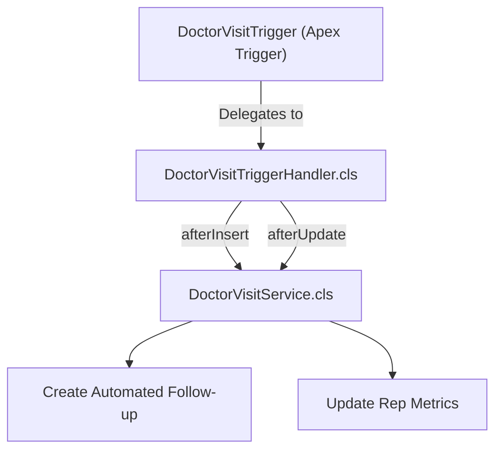

# 06. Apex Architecture & Trigger Framework

[← Back to Master Documentation Index](../PharmaConnect_Project_Documentation.md) | [← Prev: 05. LWC Architecture](05_LWC_Architecture.md) | [Next: 07. Automation & Rules →](07_Automation_and_Business_Rules.md)

---

## 1. Class Inventory & Layering

All Apex code adheres to the **Separation of Concerns (SoC)** enterprise architecture:

```text
force-app/main/default/classes/
├── controllers/
│   ├── HealthcareProviderController.cls
│   ├── VisitController.cls
│   ├── ProductController.cls
│   ├── SampleRequestController.cls
│   ├── SalesOrderController.cls
│   ├── DashboardController.cls
│   └── GlobalSearchController.cls
├── services/
│   ├── HealthcareProviderService.cls
│   ├── DoctorVisitService.cls
│   ├── SampleRequestService.cls
│   ├── SalesOrderService.cls
│   ├── TargetCalculationService.cls
│   └── NotificationService.cls
├── selectors/
│   ├── HealthcareProviderSelector.cls
│   ├── DoctorVisitSelector.cls
│   ├── ProductSelector.cls
│   ├── SampleRequestSelector.cls
│   └── SalesOrderSelector.cls
├── triggers/
│   ├── DoctorVisitTrigger.trigger
│   ├── SampleRequestTrigger.trigger
│   └── SalesOrderTrigger.trigger
├── handlers/
│   ├── ITriggerHandler.cls
│   ├── TriggerHandlerBase.cls
│   ├── DoctorVisitTriggerHandler.cls
│   ├── SampleRequestTriggerHandler.cls
│   └── SalesOrderTriggerHandler.cls
└── async/
    ├── RecalculateTargetsQueueable.cls
    ├── MonthlyTargetBatch.cls
    └── DailyFollowUpReminderSchedulable.cls
```

---

## 2. Production SOQL Queries (`WITH USER_MODE`)

### Filtered Territory Query
```apex
// HealthcareProviderSelector.cls
public with sharing class HealthcareProviderSelector {
    public static List<Healthcare_Provider__c> getActiveProvidersByTerritory(String territory) {
        return [
            SELECT Id, Name, Provider_Name__c, Specialization__c, License_Number__c,
                   Phone__c, Email__c, Account__r.Name, Territory__c, Status__c
            FROM Healthcare_Provider__c
            WHERE Territory__c = :territory 
              AND Status__c = 'Active'
            WITH USER_MODE
            ORDER BY Provider_Name__c ASC
            LIMIT 200
        ];
    }
}
```

### Parent-to-Child Relationship Query
```apex
// DoctorVisitSelector.cls
public with sharing class DoctorVisitSelector {
    public static List<Doctor_Visit__c> getRecentVisitsWithDiscussions(Set<Id> providerIds) {
        return [
            SELECT Id, Name, Visit_Date__c, Outcome__c, Medical_Representative__r.Name,
                   (SELECT Id, Product__r.Name, Interest_Level__c, Feedback__c, Follow_up_Required__c 
                    FROM Product_Discussions__r)
            FROM Doctor_Visit__c
            WHERE Healthcare_Provider__c IN :providerIds
              AND Status__c = 'Completed'
            WITH USER_MODE
            ORDER BY Visit_Date__c DESC
            LIMIT 50
        ];
    }
}
```

### Real-Time Aggregation Query
```apex
// SalesOrderSelector.cls
public with sharing class SalesOrderSelector {
    public static Decimal getMonthlySalesTotalForRep(Id repId, Date monthStart, Date monthEnd) {
        AggregateResult[] results = [
            SELECT SUM(Total_Amount__c) totalSales
            FROM Sales_Order__c
            WHERE Sales_Representative__c = :repId
              AND Status__c = 'Invoiced'
              AND Order_Date__c >= :monthStart 
              AND Order_Date__c <= :monthEnd
            WITH USER_MODE
        ];
        return results.isEmpty() || results[0].get('totalSales') == null 
            ? 0.00 
            : (Decimal)results[0].get('totalSales');
    }
}
```

---

## 3. SOSL Global Search Implementation

```apex
// GlobalSearchController.cls
public with sharing class GlobalSearchController {
    
    public class SearchResultWrapper {
        @AuraEnabled public List<Healthcare_Provider__c> providers;
        @AuraEnabled public List<Account> accounts;
        @AuraEnabled public List<Product2> products;
        @AuraEnabled public List<Doctor_Visit__c> visits;
    }

    @AuraEnabled(cacheable=true)
    public static SearchResultWrapper executeGlobalSearch(String searchTerm) {
        if (String.isBlank(searchTerm) || searchTerm.trim().length() < 2) {
            return new SearchResultWrapper();
        }

        String sanitizedTerm = String.escapeSingleQuotes(searchTerm.trim()) + '*';
        
        List<List<SObject>> searchResults = [
            FIND :sanitizedTerm IN ALL FIELDS
            RETURNING 
                Healthcare_Provider__c(Id, Name, Provider_Name__c, Specialization__c, Territory__c WHERE Status__c = 'Active'),
                Account(Id, Name, Type, BillingCity),
                Product2(Id, Name, ProductCode, Family WHERE IsActive = TRUE),
                Doctor_Visit__c(Id, Name, Visit_Date__c, Healthcare_Provider__r.Provider_Name__c, Status__c)
            LIMIT 20
        ];

        SearchResultWrapper wrapper = new SearchResultWrapper();
        wrapper.providers = (List<Healthcare_Provider__c>) searchResults[0];
        wrapper.accounts  = (List<Account>) searchResults[1];
        wrapper.products  = (List<Product2>) searchResults[2];
        wrapper.visits    = (List<Doctor_Visit__c>) searchResults[3];
        return wrapper;
    }
}
```

---

## 4. Trigger Architecture & Handler Pattern



### Base Handler Contract
```apex
public interface ITriggerHandler {
    void beforeInsert(List<SObject> newItems);
    void beforeUpdate(Map<Id, SObject> newItems, Map<Id, SObject> oldItems);
    void beforeDelete(Map<Id, SObject> oldItems);
    void afterInsert(Map<Id, SObject> newItems);
    void afterUpdate(Map<Id, SObject> newItems, Map<Id, SObject> oldItems);
    void afterDelete(Map<Id, SObject> oldItems);
    void afterUndelete(Map<Id, SObject> newItems);
}
```

### Trigger Implementation
```apex
// DoctorVisitTrigger.trigger
trigger DoctorVisitTrigger on Doctor_Visit__c (before insert, after insert, before update, after update) {
    DoctorVisitTriggerHandler handler = new DoctorVisitTriggerHandler();
    
    if (Trigger.isBefore && Trigger.isInsert) {
        handler.beforeInsert(Trigger.new);
    } else if (Trigger.isAfter && Trigger.isInsert) {
        handler.afterInsert(Trigger.newMap);
    } else if (Trigger.isBefore && Trigger.isUpdate) {
        handler.beforeUpdate(Trigger.newMap, Trigger.oldMap);
    } else if (Trigger.isAfter && Trigger.isUpdate) {
        handler.afterUpdate(Trigger.newMap, Trigger.oldMap);
    }
}
```

---

## 5. Asynchronous Apex

| Mechanism | Class Name | Business Purpose | Execution Trigger |
| :--- | :--- | :--- | :--- |
| **Queueable Apex** | `RecalculateTargetsQueueable.cls` | Recalculate monthly sales quota realization upon order completion. | Enqueued from `SalesOrderTriggerHandler`. |
| **Batch Apex** | `MonthlyTargetBatch.cls` | Evaluates monthly targets and generates achievement snapshots. | Runs on the 1st of each month (batch size: 200). |
| **Schedulable Apex**| `DailyFollowUpReminderSchedulable.cls`| Queries overdue and impending follow-ups and sends notification alerts. | Cron: `0 0 6 * * ?` (Daily at 6:00 AM). |

---

[Next: 07. Automation & Business Rules →](07_Automation_and_Business_Rules.md)
