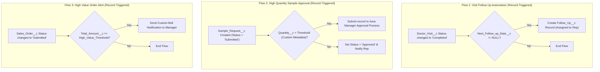

# 07. Automation, Business Rules & Approvals

[← Back to Master Documentation Index](../PharmaConnect_Project_Documentation.md) | [← Prev: 06. Apex & Triggers](06_Apex_and_Triggers.md) | [Next: 08. Analytics & Reporting →](08_Analytics_and_Reporting.md)

---

## 1. Flow Automation Architecture



---

## 2. Approval Process Architecture (Free Dev Org Setup)

### Sample Request Approval Process
* **Target Object:** `Sample_Request__c`
* **Entry Criteria:** `Quantity__c > 20`
* **Approver Routing in Free Dev Org:**
  * In **Setup → Users**, open **User 2 (Medical Rep)** and set the **Manager** lookup field to **User 1 (Admin / Area Manager)**.
  * In the Approval Process Step, set Assigned Approver to: **"Manager"**.
* **Initial Submission Action:** Set `Status__c = 'Pending Approval'`, Lock record from editing.
* **Final Approval Action:** Set `Status__c = 'Approved'`, Set `Approval_Date__c = NOW()`, Set `Approved_By__c = CurrentUserId`.
* **Final Rejection Action:** Set `Status__c = 'Rejected'`, Unlock record.

---

## 3. Custom Metadata (`Pharma_Business_Rule__mdt`)

To avoid hardcoded constants in Apex and Flows, all operational thresholds are managed via Custom Metadata (**Setup → Custom Code → Custom Metadata Types**).

### Metadata Schema
* **Master Label:** `Pharma Business Rule`
* **API Name:** `Pharma_Business_Rule__mdt`
* **Custom Fields:**
  * `Rule_Key__c` (Text, 50, Unique)
  * `Numeric_Value__c` (Number, 16, 2)
  * `Text_Value__c` (Text, 255)
  * `Description__c` (Text, 255)

### Active Metadata Records

| Rule Key (`Rule_Key__c`) | Numeric Value | Text Value | Business Purpose |
| :--- | :---: | :---: | :--- |
| `MAX_SAMPLE_AUTO_APPROVE_QTY` | `20` | — | Maximum sample units requestable without manager approval. |
| `DEFAULT_FOLLOWUP_OFFSET_DAYS`| `7` | — | Default calendar days added when generating follow-ups. |
| `HIGH_VALUE_ORDER_THRESHOLD` | `100000.00` | — | Order value triggering executive notification. |
| `TARGET_ACHIEVEMENT_WARNING` | `80.00` | — | Realization percentage threshold for warning alerts. |
| `SAMPLE_COMPLIANCE_EMAIL` | — | `admin@example.com` | Destination for audit exception logs. |

---

## 4. Validation Rules

### 4.1 Doctor Visit: No Future Dating Completed Visits
* **Object:** `Doctor_Visit__c`
* **Rule Name:** `Prevent_Future_Completed_Visits`
* **Formula:**
  ```apex
  ISPICKVAL(Status__c, "Completed") && Visit_Date__c > NOW()
  ```
* **Error Message:** `A completed doctor visit cannot be recorded with a future date and time.`

### 4.2 Sample Request: Strictly Positive Quantities
* **Object:** `Sample_Request__c`
* **Rule Name:** `Sample_Quantity_Must_Be_Positive`
* **Formula:**
  ```apex
  ISBLANK(Quantity__c) || Quantity__c <= 0
  ```
* **Error Message:** `Sample requested quantity must be an integer greater than zero.`

### 4.3 Healthcare Provider: License Required for Active Status
* **Object:** `Healthcare_Provider__c`
* **Rule Name:** `Require_License_For_Active_Provider`
* **Formula:**
  ```apex
  ISPICKVAL(Status__c, "Active") && ISBLANK(License_Number__c)
  ```
* **Error Message:** `Healthcare Provider medical license number is mandatory before activating the record.`

### 4.4 Sales Order Line: Valid Pricing & Units
* **Object:** `Sales_Order_Line__c`
* **Rule Name:** `Check_Line_Item_Quantity_And_Price`
* **Formula:**
  ```apex
  Quantity__c <= 0 || Unit_Price__c < 0
  ```
* **Error Message:** `Quantity must be at least 1 and unit price cannot be negative.`

---

[Next: 08. Analytics & Reporting →](08_Analytics_and_Reporting.md)
