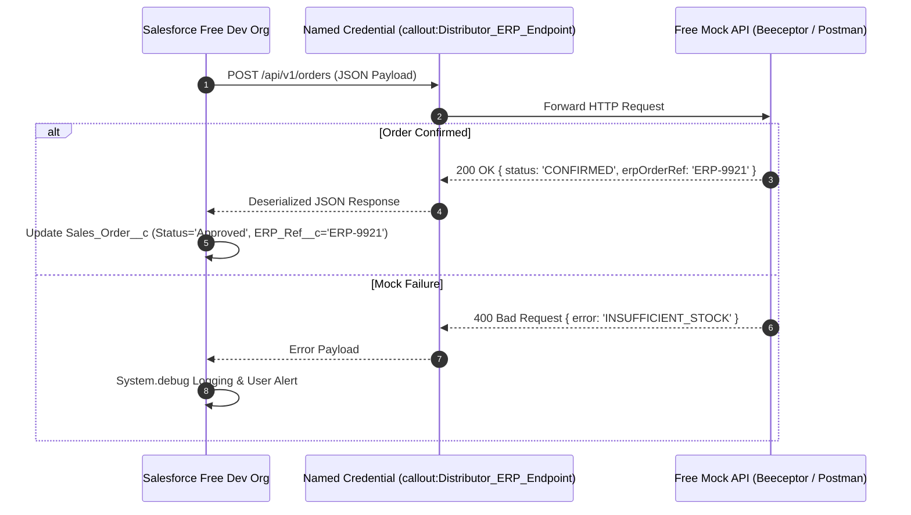

# 09. Integration Architecture & Free Mock REST API

[← Back to Master Documentation Index](../PharmaConnect_Project_Documentation.md) | [← Prev: 08. Analytics & Reporting](08_Analytics_and_Reporting.md) | [Next: 10. DevOps & CI/CD →](10_DevOps_and_CICD.md)

---

## 1. Overview & Free Mock API Strategy

To practice enterprise-grade REST callouts in a **Free Developer Edition Org** without paying for external servers, use a free mock endpoint service:
* **Option A (Instant Web-based):** [Beeceptor](https://beeceptor.com/) or [Webhook.site](https://webhook.site/) (Free, no installation required).
* **Option B (Local Dev):** [Mockoon](https://mockoon.com/) or [Postman Mock Server](https://learning.postman.com/docs/designing-and-developing-your-api/mocking-data/setting-up-mock/).

---

## 2. Sequence Diagram



---

## 3. Setting Up Free Named Credentials (Setup → Named Credentials)

1. **External Credential:** `Distributor_ERP_Security` (Authentication Protocol: No Authentication or Custom Header).
2. **Named Credential:**
   * Label: `Distributor_ERP_Endpoint`
   * Name: `Distributor_ERP_Endpoint`
   * URL: `https://pharmaconnect-mock.free.beeceptor.com` (or your Postman mock URL)
   * Generate Authorization Header: Checked

---

## 4. Apex Callout Implementation

```apex
// DistributorIntegrationService.cls
public with sharing class DistributorIntegrationService {

    public class OrderPayload {
        public String salesforceOrderId;
        public List<OrderItemPayload> items;
    }
    
    public class OrderItemPayload {
        public String productCode;
        public Integer quantity;
    }

    public static Boolean transmitSalesOrder(Id orderId) {
        Sales_Order__c orderRecord = SalesOrderSelector.getOrderWithLines(orderId);
        
        OrderPayload payload = new OrderPayload();
        payload.salesforceOrderId = orderRecord.Name;
        payload.items = new List<OrderItemPayload>();
        
        for (Sales_Order_Line__c line : orderRecord.Sales_Order_Lines__r) {
            OrderItemPayload item = new OrderItemPayload();
            item.productCode = line.Product__r.ProductCode;
            item.quantity = (Integer)line.Quantity__c;
            payload.items.add(item);
        }

        HttpRequest req = new HttpRequest();
        req.setEndpoint('callout:Distributor_ERP_Endpoint/api/v1/orders');
        req.setMethod('POST');
        req.setHeader('Content-Type', 'application/json');
        req.setBody(JSON.serialize(payload));
        req.setTimeout(12000);

        Http http = new Http();
        HttpResponse res = http.send(req);

        if (res.getStatusCode() == 200 || res.getStatusCode() == 201) {
            orderRecord.Status__c = 'Approved';
            update orderRecord;
            return true;
        } else {
            System.debug(LoggingLevel.ERROR, 'Mock ERP Callout Failed: ' + res.getBody());
            return false;
        }
    }
}
```

---

[Next: 10. DevOps & CI/CD →](10_DevOps_and_CICD.md)
