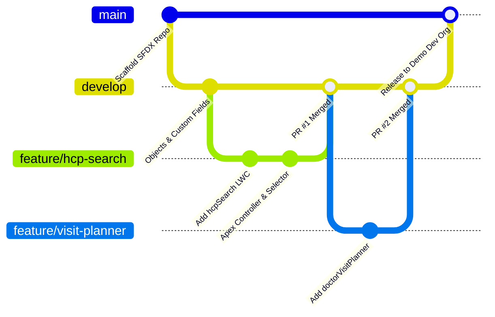

# 10. DevOps, Salesforce DX & Free CI/CD

[← Back to Master Documentation Index](../PharmaConnect_Project_Documentation.md) | [← Prev: 09. Integration Architecture](09_Integration_Architecture.md) | [Next: 11. Salesforce DevOps Center →](11_Salesforce_DevOps_Center.md)

---

## 1. Salesforce DX (SFDX) Repository Structure

```text
PharmaConnect/
├── .github/
│   └── workflows/
│       └── pr-validation.yml         # Free GitHub Actions pipeline
├── config/
│   └── project-scratch-def.json      # Optional scratch org config
├── force-app/
│   └── main/
│       └── default/
│           ├── classes/
│           ├── triggers/
│           ├── lwc/
│           ├── objects/
│           ├── flows/
│           ├── permissionsets/
│           ├── layouts/
│           ├── flexipages/
│           ├── customMetadata/
│           ├── reports/
│           ├── dashboards/
│           └── tabs/
├── manifest/
│   └── package.xml
├── scripts/
│   ├── apex/
│   └── soql/
├── .forceignore
├── .gitignore
├── README.md
└── sfdx-project.json
```

---

## 2. GitFlow Branching Strategy



---

## 3. Free GitHub Actions CI/CD Pipeline

Instead of a paid Jenkins server, use **GitHub Actions** (100% free for public and private GitHub repositories) to automatically validate every pull request against your Dev Org.

### Free GitHub Actions Workflow File (`.github/workflows/pr-validation.yml`)

```yaml
name: Salesforce PR Validation

on:
  pull_request:
    branches: [ develop, main ]
    paths:
      - 'force-app/**'

jobs:
  validate-deployment:
    runs-on: ubuntu-latest
    steps:
      - name: Checkout Code
        uses: actions/checkout@v4

      - name: Install Salesforce CLI
        run: |
          npm install --global @salesforce/cli
          sf version

      - name: Authenticate Salesforce Dev Org
        run: |
          echo "${{ secrets.SFDX_AUTH_URL }}" > authFile.txt
          sf org login sfdx-url --sfdx-url-file authFile.txt --set-default --alias devOrg
          rm authFile.txt

      - name: Validate Deployment & Run Apex Tests
        run: |
          sf project deploy validate \
            --source-dir force-app \
            --test-level RunLocalTests \
            --wait 15
```

> [!TIP]
> **How to get the free SFDX_AUTH_URL:**
> In your local terminal, run `sf org display --target-org myDevOrg --verbose --json`. Copy the `sfdxAuthUrl` string and store it in your GitHub Repository under **Settings → Secrets and variables → Actions → New repository secret** as `SFDX_AUTH_URL`.

---

[Next: 11. Salesforce DevOps Center →](11_Salesforce_DevOps_Center.md)
