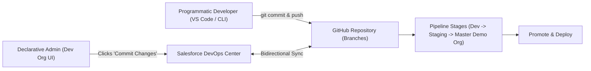
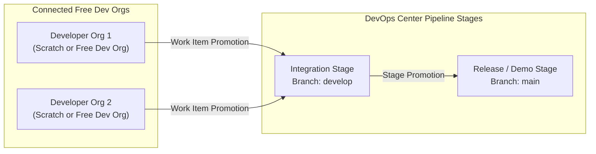

# 11. Salesforce DevOps Center (Native Change & Release Management)

[← Back to Master Documentation Index](../PharmaConnect_Project_Documentation.md) | [← Prev: 10. DevOps & CI/CD](10_DevOps_and_CICD.md) | [Next: 12. Testing Strategy →](12_Testing_Strategy.md)

---

## 1. Overview & Native Capabilities

**Salesforce DevOps Center** is a native, modern change and release management application built directly on the Salesforce Platform. It bridges the gap between **declarative admins** (who build clicks-not-code in the browser) and **programmatic developers** (who write Apex/LWC in VS Code).

### Why DevOps Center for PharmaConnect (Free Dev Org)?
* **Zero Additional Cost:** Included free with Salesforce Developer Edition orgs.
* **Native GitHub Integration:** Automatically creates branches and commits metadata to your GitHub repository behind the scenes.
* **Hybrid Team Enablement:** Allows admins to track custom field and flow changes through a graphical UI while developers use VS Code and `sf` CLI on the exact same GitHub branches.
* **Traceable Work Items:** Replaces change sets with structured **Work Items** mapped directly to user stories.

---

## 2. Enabling DevOps Center in Free Developer Edition

### Step 1: Enable DevOps Center in Setup
1. In your **User 1 (Admin)** Dev Org, navigate to **Setup → DevOps Center**.
2. Toggle the switch to **Enabled**.
3. Accept the terms and click **Install Package**. DevOps Center installs as a native Salesforce Managed Package.

### Step 2: Assign DevOps Center Permissions
Navigate to **Setup → Permission Sets** and assign the following to User 1:
* `devops_center_manager` (or `sf_devops_NamedCredentials` and `sf_devops_InitializeEnvironments`).

### Step 3: Launch the DevOps Center App
1. From the App Launcher (9 dots), search for and open **DevOps Center**.
2. Click **Connect to GitHub** and authorize your GitHub account.

---

## 3. Configuring the PharmaConnect Pipeline

Inside DevOps Center, set up a new project named **`PharmaConnect`**:

### Pipeline Mapping Table

| Pipeline Stage | Connected Environment | GitHub Branch | Stage Role |
| :--- | :--- | :--- | :--- |
| **Development** | Individual Free Dev Orgs | `feature/*` branches | Isolated feature work and testing. |
| **Integration** | Shared Integration Dev Org | `develop` | Auto-merges and validates team contributions. |
| **Production / Demo** | Master Demo Dev Org | `main` | Final staging environment for presentations. |

---

## 4. Daily Workflow with Work Items

### 4.1 Creating a Work Item
1. In DevOps Center, navigate to the **PharmaConnect** project.
2. Click **New Work Item** (e.g., `WI-000001: Implement Sample Request Approval Flow`).
3. Assign the Work Item to a team member and select the development environment.

### 4.2 Pulling and Committing Changes
1. After creating objects, fields, or flows in your Dev Org, open the Work Item in DevOps Center.
2. Click **Pull Changes**. DevOps Center queries the Source Tracking API and lists every modified metadata component.
3. Select the modified components (`Sample_Request__c`, `Pharma_Business_Rule__mdt`, etc.).
4. Enter a commit comment (e.g., `Configured sample approval flow and metadata limit`).
5. Click **Commit Changes**. DevOps Center automatically pushes the commit to GitHub on a dedicated feature branch!

### 4.3 Promotion Through the Pipeline
1. Once testing is complete, mark the Work Item as **Ready to Promote**.
2. In the **Pipeline** tab, click **Promote** next to the Work Item.
3. DevOps Center triggers the merge into `develop` and deploys the metadata into the next environment.

---

## 5. Hybrid Coexistence: DevOps Center + Salesforce CLI

| Task | Declarative Admins (DevOps Center) | Developers (VS Code & Salesforce CLI) |
| :--- | :--- | :--- |
| **Branch Creation** | Handled automatically when Work Item is opened | `git checkout -b feature/WI-000001` |
| **Tracking Changes** | Click **Pull Changes** in web UI | `sf project retrieve start` |
| **Committing Code** | Click **Commit Changes** in web UI | `git add . && git commit -m "..."` |
| **Code Review** | Prompts to create GitHub Pull Request | GitHub PR interface |
| **Deployment** | Click **Promote** button in Pipeline UI | `sf project deploy start` or GitHub Actions |

---

[Next: 12. Testing Strategy →](12_Testing_Strategy.md)
