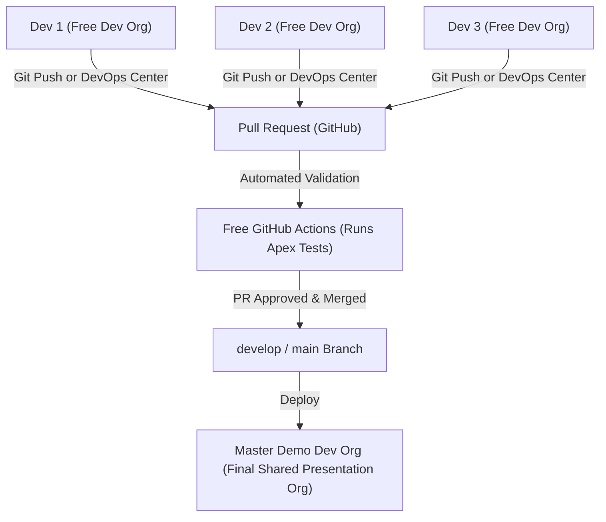
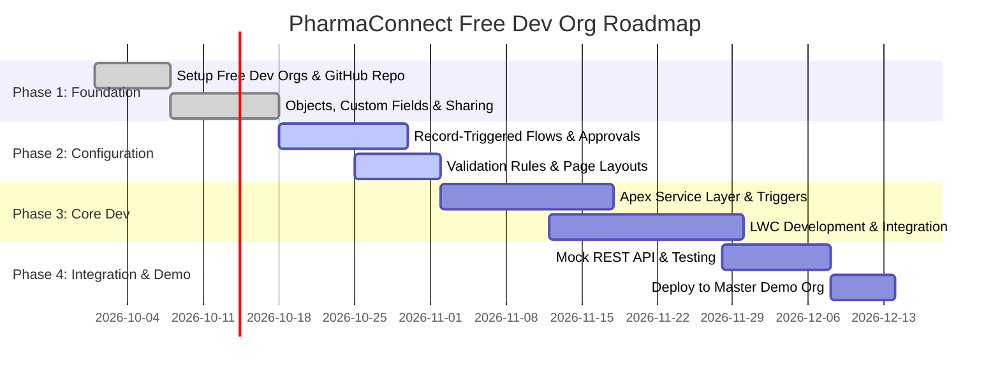
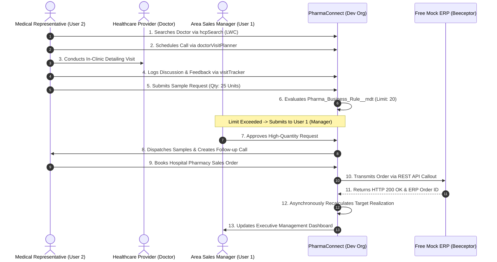

# 13. Project Management, Governance & Roadmap

[← Back to Master Documentation Index](../PharmaConnect_Project_Documentation.md) | [← Prev: 12. Testing Strategy](12_Testing_Strategy.md)

---

## 1. Team Collaboration Model for Free Dev Orgs

For an 18-member student, boot camp, or developer team working at zero cost:



1. **Individual Work:** Each team member registers their own free Dev Org at `developer.salesforce.com`.
2. **Local Development:** Developers pull down the repo, build in VS Code, deploy to their personal Dev Org using `sf project deploy start`, or use **Salesforce DevOps Center** to commit changes.
3. **Pull Requests:** PRs trigger the free GitHub Actions runner.
4. **Master Demo Org:** One designated Free Dev Org acts as the centralized **Master Demo Org** where the merged repository is deployed for presentations and grading.

---

## 2. Squad Distribution (18-Member Team Across Free Dev Orgs)

| Squad | Focus Domain | Key Technologies | Primary Deliverables |
| :---: | :--- | :--- | :--- |
| **Squad 1** | Healthcare Provider Management | LWC, Apex, SOQL, SOSL | `hcpSearch`, `globalSearch`, `HealthcareProviderService` |
| **Squad 2** | Visit & Field Engagement | LWC, Flow, Trigger Handler | `doctorVisitPlanner`, `visitTracker`, `DoctorVisitTrigger` |
| **Squad 3** | Products & Compliant Samples | Apex, Approval Process, Flow | `sampleRequest`, `SampleRequestTrigger`, Custom Metadata |
| **Squad 4** | Sales Orders & Targets | LWC, Async Apex, Roll-ups | `salesDashboard`, `targetTracker`, `MonthlyTargetBatch` |
| **Squad 5** | Security, Reports & Dashboards | Admin, Analytics, OWD | Role Hierarchy, Reports, Executive Dashboards |
| **Squad 6** | DevOps & System Integration | Git, DevOps Center, GitHub Actions, Free Mock API | DevOps Center Pipeline, CI/CD YAML, Mock REST API |

---

## 3. Free Agile & Task Management

Teams can track sprints and user stories at zero cost using:
* **Option 1 (Recommended): GitHub Projects** (Kanban board built directly into your GitHub repo, completely free).
* **Option 2: Salesforce DevOps Center Work Items** (Native Salesforce work tracking linked to GitHub commits).
* **Option 3: Free Jira Cloud** (Free for up to 10 users).

### Recommended Backlog Structure
```text
EPIC: [PHARMA-01] Healthcare Provider Search & Profiling
 ├── Task: Create Healthcare_Provider__c Custom Object & Fields
 ├── Task: Build HealthcareProviderSelector.cls with USER_MODE
 ├── Task: Develop hcpSearch LWC with responsive layout
 └── Task: Write Unit Tests with >= 85% coverage (HealthcareProviderControllerTest)
```

---

## 4. Definition of Done (DoD)

A user story is accepted as **Done** only when:
* [ ] Metadata is retrieved and tracked in the SFDX `force-app` repository structure.
* [ ] Apex code coverage is >= 85% with all unit tests passing.
* [ ] Code adheres to separation of concerns (no SOQL inside LWC controllers).
* [ ] Deployed and tested cleanly in your local free Developer Edition Org.
* [ ] GitHub Actions CI pull request validation passes with zero errors.
* [ ] Peer code review approved by at least 1 teammate.
* [ ] Pull request merged into `develop` via GitHub or Salesforce DevOps Center.

---

## 5. Delivery Phases & Milestone Roadmap



---

## 6. Core vs. Advanced Implementation Scope

```mermaid
flowchart LR
    subgraph Core ["Core Scope (Fully Supported in Free Dev Org)"]
        direction TB
        C1["HCP & Representative Custom Objects"]
        C2["Field Visits & Product Detailing"]
        C3["Sample Requests with Flow & Approval Process"]
        C4["Sales Orders & Automatic Target Calculation"]
        C5["Responsive LWCs (Search, Planner, Tracker)"]
        C6["Security: OWD, Role Hierarchy & 2-User Profiles"]
        C7["Operational Reports & Executive Dashboard"]
    end

    subgraph Advanced ["Advanced Scope (Free Dev Tools)"]
        direction TB
        A1["REST Callout to Free Beeceptor / Mockoon API"]
        A2["Named Credentials & JSON Parsing"]
        A3["Scheduled & Batch Apex Automation"]
        A4["Salesforce DevOps Center & GitHub Actions Pipeline"]
    end

    Core --> Advanced
```



---

## 7. End-to-End Business Scenario Execution



---

## 8. Project Success & Free Dev Org Checklist

To successfully showcase your project, verify each capability against this checklist:

- [x] **2-User Setup:** User 1 configured as Admin/Manager and User 2 configured as Medical Rep with manager assignment.
- [x] **Provider Profiling:** Field reps can search, filter, and view doctor profiles based on territory assignment.
- [x] **Field Detailing:** Completed visits automatically capture individual product discussions, doctor interest levels, and objections.
- [x] **Automated Follow-ups:** Completed visits requiring follow-up automatically generate `Follow_Up__c` tasks.
- [x] **Compliant Sample Allocation:** Sample requests under the threshold approve automatically; requests exceeding threshold route to User 1 for approval.
- [x] **Configurable Rule Engine:** Thresholds for approvals and alerts are configured through `Pharma_Business_Rule__mdt` without code changes.
- [x] **Secondary Order Realization:** Sales orders calculate line items accurately and update monthly quota realization for the rep.
- [x] **Executive Dashboards:** Real-time visibility into sales progress, rep call compliance, and territory trends.
- [x] **Zero-Cost REST Callouts:** Working HTTP callout using Named Credentials connected to a free mock endpoint (Beeceptor/Mockoon).
- [x] **DevOps Center & GitHub Actions:** Source tracking via Salesforce DevOps Center and automated pull request validation with GitHub Actions.

---

[← Back to Master Documentation Index](../PharmaConnect_Project_Documentation.md)
